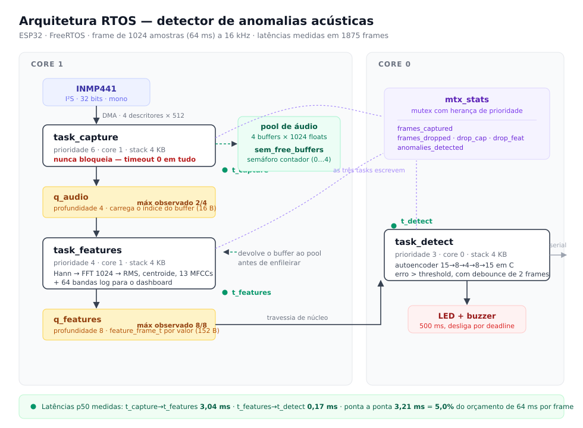
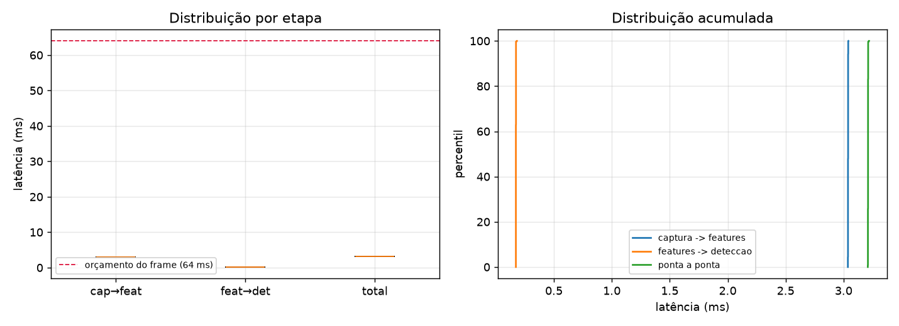

# Detector de Anomalias Acústicas: Relatório Técnico

**Hardware:** ESP32 DevKit v1 · microfone INMP441 (I²S) · 2 LEDs

**Anomalia escolhida:** desvio do perfil acústico normal do ambiente.

O detector não aprende o que é uma anomalia, e sim o que é normal, sinalizando
aquilo que destoa. Escolheu-se essa formulação porque ela corresponde à situação
real em manutenção preditiva e em monitoramento de ambientes, onde existem horas
de dados do estado normal e quase nenhum exemplo do evento que se quer detectar.

---

## 1. Arquitetura RTOS



```
task_capture  (prio 6, core 1)   I²S ──▶ pool de 4 buffers
     │  q_audio      profundidade 4, carrega o índice do buffer
     │  sem_free_buffers (semáforo contador, 0…4)
     ▼
task_features (prio 4, core 1)   pool ──▶ feature_frame_t
     │  q_features   profundidade 8, struct por valor
     ▼
task_detect   (prio 3, core 0)   detecção ──▶ LEDs
```

O mutex `mtx_stats` protege os contadores globais, escritos pelas três tarefas.

### Por que três tarefas

As etapas possuem naturezas de prazo distintas. A captura tem prazo físico,
pois o DMA do I²S não espera e um frame perdido é irrecuperável. A extração de
features é computação pesada, porém sem prazo próprio. A detecção é apenas
decisão, a mais barata das três.

Num laço único, o pior caso de qualquer etapa passaria a ser o pior caso de
todas, de modo que um pico na FFT atrasaria a leitura do I²S e derrubaria
áudio. Com a separação, cada etapa absorve o próprio jitter na fila que a
precede.

### Por que essas prioridades

A ordem 6 > 4 > 3 decorre do critério acima. A captura preempta qualquer outra
tarefa por ser a única que perde dado ao atrasar, e a detecção fica por último
porque seu atraso não é percebido.

Captura e features foram fixadas no core 1 e a detecção no core 0. Como o core
0 também executa as tarefas de sistema do ESP-IDF, deixar ali a tarefa de menor
prioridade evita que o sistema dispute com o caminho crítico do áudio.

### Por que fila, e não variável compartilhada

Uma variável compartilhada exigiria exclusão mútua em toda leitura e escrita, e
o produtor bloquearia enquanto o consumidor estivesse na seção crítica, que é
justamente o que a captura não pode fazer.

A fila do FreeRTOS resolve os dois problemas, pois é livre de corrida por
construção e aceita `timeout 0`, transformando contenção em falha imediata em
vez de bloqueio. A captura tenta enfileirar e, caso não haja espaço, descarta e
segue.

As duas filas carregam conteúdos diferentes de propósito. A `q_audio` carrega o
índice do buffer, nunca as 1024 amostras, já que copiar 4 KB por frame anularia
o sentido de manter um pool. A `q_features` carrega a struct por valor, com 152
bytes, caso em que copiar sai mais barato do que administrar um segundo pool.

### Mutex, e não semáforo binário

Optou-se por mutex porque o do FreeRTOS implementa herança de prioridade, o que
o semáforo binário não faz. Sem ela, a detecção (prioridade 3) segurando o lock
poderia ser preemptada enquanto a captura (prioridade 6) aguarda, configurando
inversão de prioridade na tarefa que menos pode esperar.

---

## 2. Análise de latência

Cada frame carrega três timestamps. Cada etapa medida inclui a espera na fila
que a precede, que é onde um eventual gargalo se manifestaria.

Mediu-se sobre 1875 frames, correspondentes a 120 s contínuos em ambiente real:

| Etapa | p50 | p95 | p99 | % do frame |
|---|---|---|---|---|
| captura → features | 3,04 ms | 3,04 ms | 3,04 ms | 4,8% |
| features → detecção | 0,17 ms | 0,17 ms | 0,17 ms | 0,3% |
| ponta a ponta | 3,21 ms | 3,21 ms | 3,21 ms | 5,0% |



O gargalo está na extração de features, com 3,04 ms, ou 95% do tempo total,
dominado pela FFT de 1024 pontos e pela filterbank mel. A inferência do
autoencoder, que aparentaria ser a parte cara, consome 0,17 ms, uma vez que as
quatro multiplicações de matriz de uma rede 15→8→4→8→15 somam 402 operações.

Observa-se que os percentis diferem em menos de 10 µs. Isso não é erro de
medição, mas consequência de as filas permanecerem vazias: sem contenção, todo
frame percorre o mesmo caminho no mesmo tempo. Com 5% de ocupação do orçamento
de 64 ms, a folga é de vinte vezes, o que explica por que nada enfileira.

---

## 3. Resultados

### Dados

| Conjunto | Frames | Duração |
|---|---|---|
| Normal | 19.345 | 20,6 min de ambiente real |
| Anomalia | 751 | 48 s de palmas, assobio, batidas e fala |

As duas classes foram captadas pelo mesmo microfone, na mesma sala e na mesma
sessão. Essa condição é necessária para que o número signifique alguma coisa,
conforme se discute adiante.

### Modelo

Autoencoder 15→8→4→8→15 treinado somente com som normal. A média e o desvio da
normalização, bem como o threshold, saem de um conjunto de validação separado do
treino, pois calculá-los sobre os dados de treino produziria um número
otimista.

O threshold foi fixado no percentil 92 do erro de reconstrução, com
`debounce_n = 3`.

### Matriz de confusão, por janela de aproximadamente 1 s

| | previu normal | previu anomalia |
|---|---|---|
| normal | 240 | 1 |
| anomalia | 0 | 46 |

Acurácia de 99,65%, com 0,41% de falso positivo e 100% de detecção.

Cabe a ressalva de que são apenas 46 janelas anômalas, de modo que cada uma vale
2,2 pontos percentuais. O número de falso positivo, medido sobre 241 janelas, é
mais robusto.

### Threshold e debounce formam um par

Calibrar somente o threshold não resolve, pois cada ponto de falso positivo
custa detecção e nenhum valor atende às duas metas simultaneamente.

| debounce | percentil | falso positivo | detecção |
|---|---|---|---|
| 2 | 94 | 3,73% | 97,83% |
| 2 | 96 | 1,66% | 84,78% |
| 3 | 92 | 0,41% | 100% |

Verificou-se que o debounce é o parâmetro mais eficaz. Mantido o mesmo
threshold, passar de 2 para 3 frames consecutivos derruba o falso positivo de
7,47% para 0,41% sem perder nenhum evento, já que uma palma dura vários frames
e um pico de ruído não. É isso que permite baixar o threshold e recuperar os
eventos mais fracos.

O custo é a latência de alerta, que passa de 128 ms para 192 ms entre o som e o
LED.

---

## 4. Discussão: conflitos de concorrência

### A captura não pode bloquear

O conflito central está em que a captura tem prazo e as demais etapas não. Se a
extração atrasa, o pool esgota e a captura precisa escolher entre esperar,
perdendo áudio no DMA, ou descartar. Adotou-se a política de descartar sem
jamais esperar, com `timeout 0` em todo `take` e `send` da captura.

Há um detalhe pouco evidente: na ausência de buffer livre, a captura continua
lendo do I²S e joga o frame fora. Parar de ler faria o DMA transbordar e
corromper o alinhamento do stream, o que custaria muito mais do que um frame.

### Evidência: teste de descarte forçado

Atrasos artificiais configuráveis forçam os dois modos de saturação. Como os
contadores são separados por etapa, o log indica onde o frame caiu.

| Caso | `captured` | `dropped` | na captura | nas features |
|---|---|---|---|---|
| Normal | 8848 | 0 | 0 | 0 |
| Detecção lenta | 478 | 320 | 0 | 320 |
| Features lentas | 153 | 323 | 323 | 0 |

Com a detecção lenta, a `q_features` enche e quem descarta é a extração,
permanecendo a captura intacta. Com as features lentas, o pool esgota e quem
descarta é a própria captura. Em nenhum dos dois casos ela parou, de forma que o
sistema degrada perdendo resolução temporal, não disponibilidade.

### Um bug que só apareceu em hardware

A primeira versão imprimia uma linha no serial a cada descarte, de dentro da
captura. Isso viola a regra da própria tarefa, pois `printf` bloqueia quando o
FIFO de transmissão do UART enche, que é exatamente o que ocorre quando há
muitos descartes. A tarefa que não pode bloquear estava bloqueando, no pior
momento possível.

O sintoma era estranho, com milhares de linhas idênticas carregando o mesmo
número de sequência. Carimbar o horário de chegada esclareceu o caso, pois as
cópias chegavam todas no mesmo instante, tratando-se de texto já renderizado
sendo reenviado a cada retentativa da escrita travada. Corrigiu-se removendo o
`printf` do caminho de descarte, visto que os contadores bastam.

### Estar em anomalia e entrar em anomalia

A função de threshold disparava uma única vez por episódio. Com anomalia
sustentada, o LED acendia e apagava com o som ainda ocorrendo, de modo que o
sistema estava detectando sem parecer.

Trata-se de duas perguntas distintas, com consumidores distintos. O estado
aciona o LED, que renova o prazo a cada frame, enquanto a transição alimenta o
contador e o log. Em 40 s de captura, 95% dos frames ficaram acima do threshold
mantendo o LED aceso, contra 15 episódios contados.

### O modelo aprende o sensor junto com o fenômeno

Uma verificação disparou 195 alertas em 6 minutos num ambiente que deveria estar
silencioso. O RMS estava igual ao do treino, porém o centroide havia subido de
938 para 1113 Hz, pois a ventoinha da máquina tinha ligado. Mesma energia,
timbre diferente.

O comportamento é o esperado, já que o detector reage a desvio espectral e não a
volume, mas evidencia o limite da abordagem: o perfil normal precisa cobrir as
condições reais de operação. Quem for reproduzir o trabalho deve coletar o
normal no ambiente e nas condições da demonstração.

O mesmo efeito invalidou uma avaliação inteira. Ao testar com o dataset público
ESC-50 processado offline, obteve-se 100% de detecção em todos os níveis. O
número era falso, pois os clipes de fundo do próprio dataset, como chuva, vento
e grilos, também disparavam 100%. O que o detector reconhecia era áudio que não
havia saído daquele microfone, e não anomalia. Passou-se então a executar o
grupo de controle junto e a imprimir a separação entre os dois, de modo que o
viés não possa mais passar despercebido.

---

## 5. Extensão: identificação de músicas

A mesma arquitetura, com outro algoritmo dentro das Tasks 2 e 3, identifica
faixas de um acervo de 8 músicas pelo microfone. Os dois detectores executam no
mesmo frame, com o autoencoder custando 0,17 ms e o casamento 46 µs, e cada um
aciona o próprio LED.

Essa é a evidência mais direta de que o pipeline de concorrência é agnóstico ao
algoritmo, uma vez que nenhuma task, fila, semáforo ou mutex precisou mudar.

O método empregado é o do Shazam. Cada frame produz alguns picos espectrais,
pares de picos viram hashes, e cada hash é buscado num banco embarcado, votando
num deslocamento temporal. Um casamento verdadeiro alinha todos os pares no
mesmo deslocamento, ao passo que colisões se espalham. Numa consulta real de
6 s foram lançados 106.627 votos sobre 40.960 bins, o que daria média de 2,6 se
fossem uniformes, tendo o bin correto recebido 242 contra 29 do melhor
concorrente.

| | |
|---|---|
| Banco | 222.515 entradas (1,7 MB) em flash, busca binária |
| Votação | histograma `[música][offset]`, 80 KB em RAM |
| Decisão | ao menos 60 votos e 1,5 vez o segundo colocado |
| Acerto | 8/8, sem nenhum falso em 3,3 min de ambiente |
| Recursos | RAM 41,1% e Flash 64,6% de 3 MB |

---

## Validação

Erro de DSP e erro de inferência são silenciosos, pois produzem números
plausíveis e só se manifestam ao final, na forma de um modelo que não converge.
Por isso cada bloco possui um par em C e em Python, além de um teste que
comprova a concordância entre eles.

| Teste | Resultado |
|---|---|
| Features em C contra `librosa` e `scipy` | erro relativo de até 3,4e-06 |
| Inferência em C contra o `.onnx` | erro de até 7,3e-07, sem decisões divergentes em 1500 frames |
| Peak picking em C contra Python | igualdade exata |
| Casamento em C contra Python | 8/8, concordância total |

Em hardware, registrou-se palma a 107 vezes o piso de ruído, tom de 1 kHz pelo
alto-falante medindo centroide de 981 Hz e 9,5 minutos contínuos sem um frame
descartado.

---

## Reprodutibilidade

Todo parâmetro de DSP, pinagem e RTOS reside em `params.json`. O firmware não lê
JSON, pois um script o traduz para `include/config.h`, enquanto os scripts
Python leem o arquivo diretamente. Nenhum número é duplicado à mão entre os dois
lados, o que permite afirmar que o pipeline em C e o em Python são o mesmo
pipeline.
